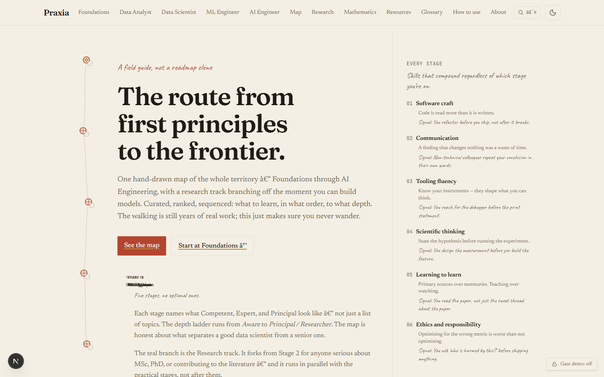

# Praxia

**A curated, opinionated roadmap for the Data → AI career and research journey.**

---

## What this is

Most learning roadmaps in this field are either vague link dumps or shallow "get hired in 3 months" guides. Praxia is neither. It maps the complete progression — Foundations → Data Analyst → Data Scientist → ML Engineer → AI Engineer, with a parallel Research track — and for each stage specifies exactly what to learn, in what order, to what depth, with an honest verdict on every resource.

The product's value is sequencing and curation, not raw links. It tells a motivated person not just _what_ to study, but _why that order_ and _when they can move on_. It treats the reader as capable of doing the real work.

I built this because I was the target user. Navigating this field without a clear map costs months — you overcorrect toward tutorials, miss the math you'll need later, and can't distinguish "good enough to use" from "good enough to know deeply." This is the map I wish I'd had. I'm still walking it, which means the curation stays honest: I'm not claiming mastery, I'm sharing the sequence that actually makes sense from inside the work.

### Why trust this curation?

The value isn't the links — those are publicly findable. It's the judgments: which book to start with versus which one to read second, what to skip entirely, where the free option is better than the paid one, and where the apparent shortcut creates a gap you'll hit two stages later. Every resource on the site has a one-sentence honest verdict and a "use this if…" clause. Paid resources are labelled. Anything that might become outdated is flagged for review. The curation is opinionated because vague recommendations aren't recommendations.

---



---

## Status


-green>)

<!-- TODO: Add a GitHub Actions CI workflow and replace the line below with a real build badge -->
<!--  -->

---

## Tech stack

- **Framework:** Next.js 16.2.9, App Router, static export — no server required
- **Language:** TypeScript 5 throughout; Zod 4 for runtime schema validation
- **Styling:** Tailwind CSS v4 (CSS-first config); design tokens in `src/app/globals.css`
- **Content:** Stage curriculum in `src/app/[stage]/page.tsx`; all resources in `src/lib/resources.ts`; math page in MDX with KaTeX
- **Search:** Client-side full-text search over resources + glossary + pages; no external library
- **Fonts:** Fraunces · Newsreader · Caveat · JetBrains Mono — loaded via `next/font/google`
- **Persistence:** Progress tracking via `localStorage`; no backend, no auth
- **Hosting:** Vercel (static export)

---

## Getting started

**Prerequisites**

- Node.js ≥ 24.16.0 (see `.nvmrc`). If you use nvm: `nvm use`.
- npm (the repo uses a `package-lock.json`; other package managers will work but aren't tested).

**Clone and install**

```bash
git clone https://github.com/Priyrajsinh/praxia.git
cd praxia
npm install
```

**Run the dev server**

```bash
npm run dev
```

Open [http://localhost:3000](http://localhost:3000). The dev server uses Turbopack.

**Production build**

```bash
npm run build
```

Outputs a fully static site to `.next/`. All 21 routes pre-render at build time.

---

## Project structure

```
src/
  app/                   # Next.js App Router — one directory per route
    page.tsx             # Landing page
    layout.tsx           # Root layout: shell, fonts, metadata, JSON-LD
    [stage]/page.tsx     # Stage routes: foundations, data-analyst, data-scientist,
                         #   machine-learning-engineer, ai-engineer, research
    mathematics/         # Full math curriculum (page.mdx, KaTeX-rendered)
    resources/           # Master resource library (filterable, client-side)
    glossary/            # Glossary A–Z with jump nav
    map/                 # Interactive journey overview (/map)
    sitemap.ts           # Auto-generated sitemap.xml
    robots.ts            # robots.txt
    opengraph-image.tsx  # Dynamic OG image (edge runtime)
    icon.svg             # Favicon

  components/
    layout/              # Shell: header, footer, reading-shell, theme toggle
    spine/               # Hand-drawn SVG route line + scroll-driven brass marker
    stage/               # Stage template: StageSection, DepthLadder, ResourceCard,
                         #   TopicChecklist, Marginalia, CrossCuttingSidebar
    resources/           # /resources master page (client filter + search)
    search/              # Cmd+K search dialog (keyboard-accessible, native <dialog>)
    gate/                # Gate stub: GateWall + GateDemoToggle (cosmetic, v1)
    map/                 # /map page SVG component

  lib/
    resources.ts         # ← EDIT THIS to add/change resources. Single source of truth
                         #   for all ~50 curated entries. Zod-validated at build time.
    schema.ts            # Zod schemas: Resource, Topic, StageMeta
    search.ts            # Search index + substring scoring
    journey.ts           # SVG path geometry shared between spine + map
    nav.ts               # Navigation structure

public/
  sketches/              # Ink-sketch SVG illustrations for concept diagrams

content/                 # Reserved for future MDX content files
```

---

## Available scripts

| Script            | Command                | What it does                                         |
| ----------------- | ---------------------- | ---------------------------------------------------- |
| Dev server        | `npm run dev`          | Next.js + Turbopack with hot reload                  |
| Production build  | `npm run build`        | Full static export — typecheck + compile + prerender |
| Production server | `npm start`            | Serves the built `.next/` output locally             |
| Lint              | `npm run lint`         | ESLint across all source files                       |
| Typecheck         | `npm run typecheck`    | `tsc --noEmit` — type errors without emitting JS     |
| Format            | `npm run format`       | Prettier — rewrites all files in place               |
| Format check      | `npm run format:check` | Prettier — check only, exits non-zero if dirty (CI)  |

Run `npm run lint && npm run typecheck && npm run build` before any commit that changes source files.

---

## How to edit content

**Adding or updating a resource**

All curated resources live in one file: `src/lib/resources.ts`. Each entry is a typed object validated by the `ResourceSchema` in `src/lib/schema.ts`. Add an entry to the array; the build will fail if required fields are missing or the URL is malformed. Never add a URL you haven't verified — the schema enforces this by intent.

**Editing stage curriculum** (concepts, projects, exit criteria)

Each stage is its own route file:

```
src/app/foundations/page.tsx
src/app/data-analyst/page.tsx
src/app/data-scientist/page.tsx
src/app/machine-learning-engineer/page.tsx
src/app/ai-engineer/page.tsx
src/app/research/page.tsx
```

The route file is the content file for that stage. Edit it directly — the template components (`<StageSection>`, `<DepthLadder>`, `<TopicChecklist>`) are curriculum-agnostic; no component code needs to change when curriculum content changes.

**Editing the math page**

`src/app/mathematics/page.mdx` — standard MDX with LaTeX math delimiters (`$...$` inline, `$$...$$` display). KaTeX renders at build time.

**Editing the glossary**

`src/app/glossary/page.tsx` — the terms array at the top of the file.

---

## Conventions

- **TypeScript throughout.** No `any`; types are the first line of documentation.
- **Commit messages follow conventional commits** — `feat:`, `fix:`, `chore:`, `docs:`, `refactor:`. Keep messages short and specific.
- **Content stays in data files.** Curriculum and resources are in editable `.tsx`/`.ts` data files, not hardcoded into components. If you find yourself editing a component to change copy, that copy belongs in a data file instead.
- **No invented URLs.** Every external link in `resources.ts` must be a verified, working URL. Use `needsReview: true` on anything that might change (courses, model docs, rapidly-evolving libraries).
- **§3.8 colour rule.** `route-red` and `teal` are reserved for large/graphical elements (the route line, large CTAs, headers). Never use them on small body text — `text-ink` with a tinted badge background is the correct pattern.

---

## License

**Code:** MIT — see [LICENSE](LICENSE). This covers components, configuration, and build tooling.

**Content:** All rights reserved. The curation — resource selections, editorial verdicts, stage sequencing, and curriculum structure — is original work and is not covered by the code license. Linking to any page is fine; reproducing the curation in bulk is not.

---

## Acknowledgements

Praxia points to the shoulders it stands on. These are the major free resources the site recommends most frequently:

- **ISLR** — _An Introduction to Statistical Learning_, James, Witten, Hastie, Tibshirani. Free PDF at [statlearning.com](https://www.statlearning.com).
- **ESL** — _The Elements of Statistical Learning_, Hastie, Tibshirani, Friedman. Free PDF at [hastie.su.domains/ElemStatLearn](https://hastie.su.domains/ElemStatLearn/).
- **MML** — _Mathematics for Machine Learning_, Deisenroth, Faisal, Ong. Free PDF at [mml-book.github.io](https://mml-book.github.io).
- **fast.ai** — Jeremy Howard & Rachel Thomas. Free at [fast.ai](https://www.fast.ai).
- **StatQuest** — Josh Starmer. Free on [YouTube](https://www.youtube.com/@statquest).
- **d2l.ai** — _Dive into Deep Learning_, Zhang, Lipton, Li, Smola. Free at [d2l.ai](https://d2l.ai).
- **CS50x** — Harvard University / David Malan. Free at [cs50.harvard.edu/x](https://cs50.harvard.edu/x/).
- **Karpathy's "Neural Networks: Zero to Hero"** — Andrej Karpathy. Free on [YouTube](https://www.youtube.com/playlist?list=PLAqhIrjkxbuWI23v9cThsA9GvCAUhRvKZ).

These resources are recommended because they are the best available for their respective topics — not because of any commercial relationship.

---

## Related work

Projects where I applied the ideas this map describes — from the same territory the site points to:

- **[Conformal prediction — coverage-guaranteed medical AI](https://github.com/Priyrajsinh/Conformal-Prediction-Uncertainty-Aware-Medical-AI)** — XGBoost + MAPIE conformal prediction on UCI Heart Disease data; the Stage 2 (Data Scientist) uncertainty-quantification project pattern in practice.
- **[Causal ML — heterogeneous treatment effects](https://github.com/Priyrajsinh/causal-ml-hte)** — Double ML causal inference with SHAP and a deployed dashboard; demonstrates the Stage 2 skills of going beyond prediction into explanation and causal reasoning.
- **[Real-time ML drift monitoring](https://github.com/Priyrajsinh/RealTime-ML-Drift-Monitoring)** — PSI, KS test, SHAP, and Evidently in a live monitoring pipeline; the Stage 3 (ML Engineer) production-observability work the map describes.
- **[Predictive maintenance — RUL forecasting](https://github.com/Priyrajsinh/before-it-breaks)** — LSTM-based Remaining Useful Life forecasting on NASA CMAPSS jet-engine data; end-to-end Stage 3 time-series modelling.
- **[Hybrid LLM jailbreak detector](https://github.com/Priyrajsinh/Hybrid-LLM-Jailbreak-Detector)** — a safety classifier combining multiple signals for 99.88% detection accuracy; Stage 4 (AI Engineer) applied work in LLM safety and evaluation.

The map is only as trustworthy as the work behind it. These are the receipts.
